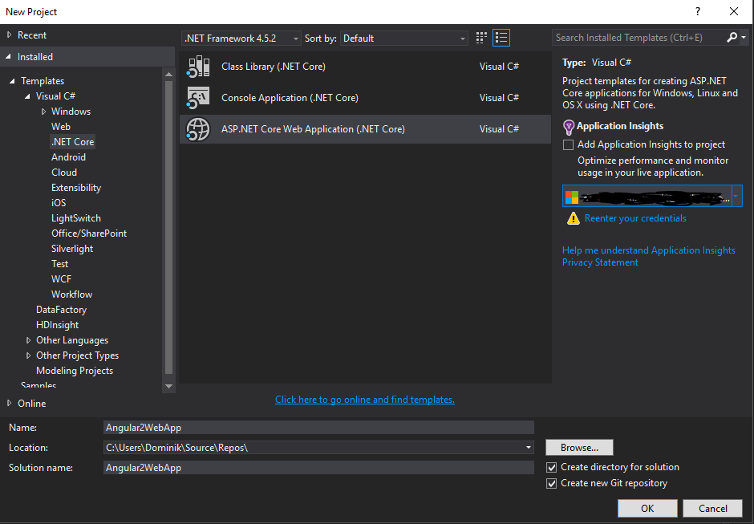
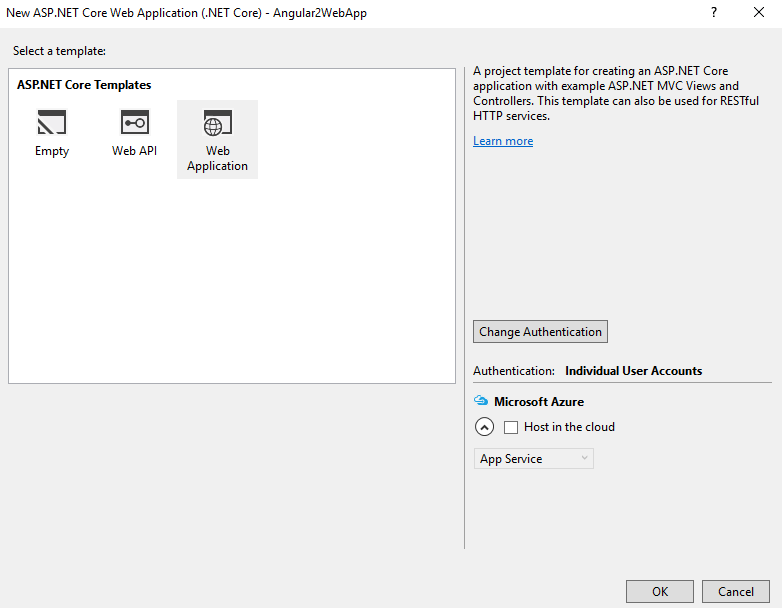
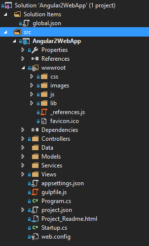

# Angular2 with ASP.NET Core - Step-by-step guide

## Intro

This guide is created on a basis of [Angular 2 - Quickstart](https://angular.io/docs/ts/latest/quickstart.html#).
You can refer to the **Angular2 - Quickstart** guide to check exact contents of application and configuration files.

In this guide I'm using following versions:
```
λ node -v 
v5.1.0
λ npm -v
3.3.12
λ dotnet --version
1.0.0-preview1-002702
```

On top of that I'm using Visual Studio 2015 Update 2. Given how quickly **dotnetcore** changes, some steps may look differently.

## Step 1 - Create new ASP.NET Core MVC application

Create a new ASP.NET Core Web Application project using Visual Studio.



Select Web Application template.



You should be able to see a similar folder structure being created.



We're going to use this folder structure when configuring Angular2 dependencies and the application itself.

## Step 2 - Modify gulpfile.js in the project folder

Angular2 Quickstart recommends using NPM to manage Angular libraries. I'm going to follow this recommendation.
By default an ASP.NET Core application, similar to one we've just created, stores the front end files inside **wwwroot** folder. 
I'm going to keep it this way and use **Gulp** to move dependencies around and put them in a folder that will be
automatically deployed with the web application.

### Add npm folders to gulpfile

Inside **gulpfile.js** you will find paths variable.
We have to modify it to keep source and destination folders of our new dependencies.

```javascript
var paths = {
    js: webroot + "js/**/*.js",
    minJs: webroot + "js/**/*.min.js",
    css: webroot + "css/**/*.css",
    minCss: webroot + "css/**/*.min.css",
    concatJsDest: webroot + "js/site.min.js",
    concatCssDest: webroot + "css/site.min.css",

    npmLibSrc: "./node_modules/",
    npmLibDest: webroot + "lib/npm"
};
```

### Add clean task for npm folders

The next step would be to use the destination folder, we just added to **paths**, 
and add a new clean task. This way Gulp will delete dependencies when we 
need to refresh our application.

```javascript
gulp.task("clean:npmlib", function (cb) {
    rimraf(paths.npmLibDest, cb);
});
```

Now, we have to add the new clean task as a global clean task dependency.

```javascript
gulp.task("clean", ["clean:js", "clean:css", "clean:npmlib"]);
```

### Create copy tasks for Angular modules and dependencies

In order to move Angular dependencies from **node_module** folder in our project root folder 
to **wwwroot** folder we need to copy required files.

```javascript
gulp.task("copy:systemjs", function () {
    return gulp.src(paths.npmLibSrc + '/systemjs/dist/**/*.*', { base: paths.npmLibSrc + '/systemjs/dist/' })
        .pipe(gulp.dest(paths.npmLibDest + '/systemjs/dist/'));
});

gulp.task("copy:angular2", function () {
    return gulp.src(paths.npmLibSrc + '/@angular/**/*.js', { base: paths.npmLibSrc + '/@angular/' })
        .pipe(gulp.dest(paths.npmLibDest + '/@angular/'));
});

gulp.task("copy:core-js", function () {
    return gulp.src(paths.npmLibSrc + '/core-js/**/*min.js', { base: paths.npmLibSrc + '/core-js/' })
        .pipe(gulp.dest(paths.npmLibDest + '/core-js/'));
});

gulp.task("copy:rxjs", function () {
    return gulp.src(paths.npmLibSrc + '/rxjs/**/*.js', { base: paths.npmLibSrc + '/rxjs/' })
        .pipe(gulp.dest(paths.npmLibDest + '/rxjs/'));
});

gulp.task("copy:zone.js", function () {
    return gulp.src(paths.npmLibSrc + '/zone.js/dist/*.*', { base: paths.npmLibSrc + '/zone.js/dist/' })
        .pipe(gulp.dest(paths.npmLibDest + '/zone.js/dist/'));
});

gulp.task("copy:angular-in-memory", function () {
    return gulp.src(paths.npmLibSrc + '/angular2-in-memory-web-api/*.js', { base: paths.npmLibSrc + '/angular2-in-memory-web-api/' })
        .pipe(gulp.dest(paths.npmLibDest + '/angular2-in-memory-web-api/'));
});

gulp.task("copy:reflect-metadata", function () {
    return gulp.src(paths.npmLibSrc + '/reflect-metadata/*.*', { base: paths.npmLibSrc + '/reflect-metadata/' })
        .pipe(gulp.dest(paths.npmLibDest + '/reflect-metadata/'));
});
```

After creating the copy tasks, we can group them so they will be more manageable.

```javascript
gulp.task('copy-dep',
    ['copy:rxjs',
    'copy:angular2',
    'copy:systemjs',
    'copy:core-js',
    'copy:zone.js',
    'copy:reflect-metadata',
    'copy:angular-in-memory']);
```

Now, we can create a new task we will use for publishing our front end application.
It will run the default **min** task and **copy-dep** we've just created.

```javascript
gulp.task("publish", ["min", "copy-dep"]);
```

From this point we can run `gulp publish` from the root folder of our project to update front end application files.


### Upgrade project.json file with new tasks

In order to include our new gulp tasks in the Visual Studio build script,
we need to modify **project.json** file prepublish scripts.

```javascript
{
    /* Removed for brevity */
    "scripts": {
        "prepublish": [ "npm install", "bower install", "gulp clean", "gulp publish" ],
        "postpublish": [ "dotnet publish-iis --publish-folder %publish:OutputPath% --framework %publish:FullTargetFramework%" ]
    }
}
```

At this point we should have all our dependencies put in the right place
and we can start configuring Angular2 to build our application.

## Step 3 - Configure SystemJS

In order to configure SystemJS we need to create a **systemjs.config.js** file
inside **wwwroot** folder.
I used SystemJS configuration file from **Angular2 - Quickstart** guide.
However, in order to load files from a **wwwroot** folder it has to be modified
respectively.

```javascript
/**
 * System configuration for Angular 2 samples
 * Adjust as necessary for your application needs.
 */
(function(global) {
// map tells the System loader where to look for things

var libFolder = 'lib/npm/';

var map = {
    'app':                        'app', // 'dist',
    '@angular':                   libFolder + '@angular',
    'angular2-in-memory-web-api': libFolder + 'angular2-in-memory-web-api',
    'rxjs':                       libFolder + 'rxjs'
};

/* Removed for brevity */
})(this);
```

## Step 4 - Create Angular2 application

Now, it's time to start building our Angular2 application.
Since the purpose of this guide is to walk through the integrations with
ASP.NET Core application I will be using sample files from [Angular 2 - Quickstart](https://angular.io/docs/ts/latest/quickstart.html#)

### app.component.ts

```typescript
import { Component } from '@angular/core';
@Component({
    selector: 'my-app',
    template: '<h1>My First Angular 2 App</h1>'
})
export class AppComponent { }
```

### main.ts

```typescript
import { bootstrap }    from '@angular/platform-browser-dynamic';
import { AppComponent } from './app.component';
bootstrap(AppComponent);
```

## Step 5 - Configure TypeScript transpiler

Create a **tsconfig.json** file in the root directory of your web application project

```typescript
{
    "compilerOptions": {
        "target": "es5",
        "module": "commonjs",
        "moduleResolution": "node",
        "sourceMap": true,
        "emitDecoratorMetadata": true,
        "experimentalDecorators": true,
        "removeComments": false,
        "noImplicitAny": false
    }
}
```

Rebuild the project with Visual Studio. If everything is configured correctly, you should be able to see generated JS files in the VIsual Studio


## Step 6 - Embed your Angular2 application in your ASP.NET Core MVC app

Now it's time to embed our Angular2 component in a Razor view so it will be served by the ASP.NET Core MVC application.
In order to do it, we'll modify the default layout file to load all the libraries required by Angular2.

### Modify Views\\Shared\\_Layout.cshtml

Inside **_Layout.cshtml** file, find the `<body>` element and replace it with the one below. 

```razor
<body>
    @RenderBody()

    <environment names="Development">

        <!-- Polyfill(s) for older browsers -->
        <script src="~/lib/npm/core-js/client/shim.min.js"></script>
        <script src="~/lib/npm/zone.js/dist/zone.js"></script>
        <script src="~/lib/npm/reflect-metadata/Reflect.js"></script>
        <script src="~/lib/npm/systemjs/dist/system.src.js"></script>
        <!-- 2. Configure SystemJS -->
        <script src="systemjs.config.js"></script>
        <script>
            System.import('app').catch(function(err){ console.error(err); });
        </script>
    </environment>
    <environment names="Staging,Production">

    </environment>

    @RenderSection("scripts", required: false)
</body>
```

### Modify Views\\Home\\Index.cshtml

For the purpose of this guide I'll be using the **home\index.cshtml** view that is being load
when we navigate to the root URL of our web app.

In order to load your **Angular2 component** just simply replace the content of the **home\index.cshtml** 
file with snippet below.

```razor
@{
    ViewData["Title"] = "Home Page";
}

<my-app>Loading my app</my-app>
```

## Step 7 - Run your application

Run your application using Visual Studio, if everything is configured properly your default 
browser should get opened with a new home index view like this:


## Troubleshooting

If you application does not appear correctly, check if NPM dependencies are properly loaded.
Try running `gulp publish` from the root folder of your web application after VS rebuild. Sometimes Visual Studio build does not execute gulp tasks correctly