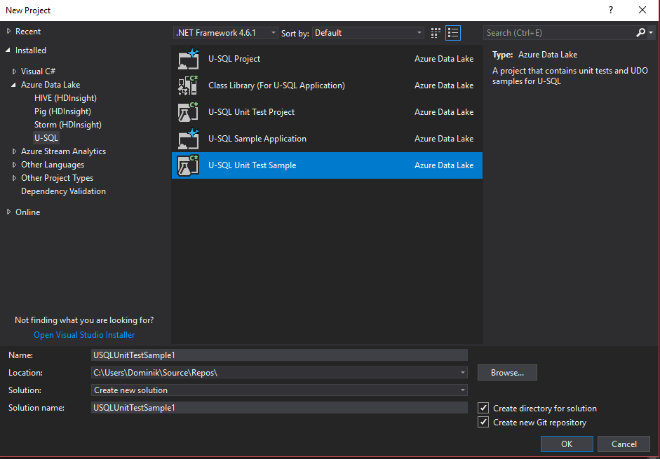
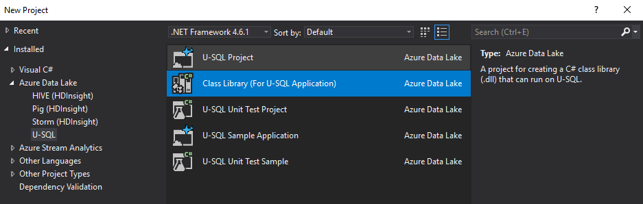
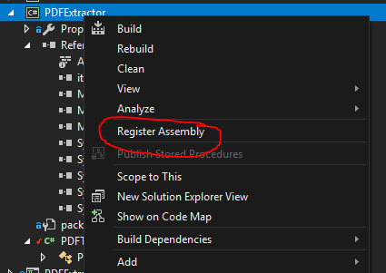
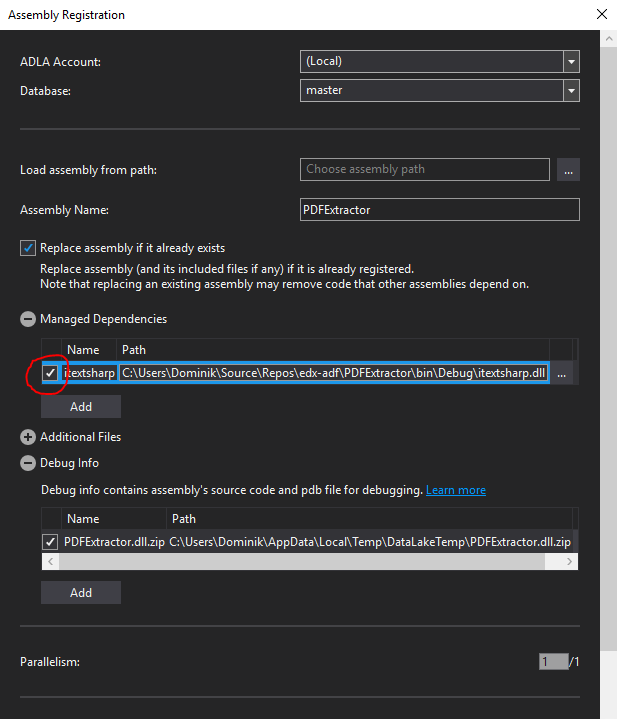

# Writing custom PDF extrator for Azure Data Lake Analytics

For sometime now I've been working on a pet project that helps me with home budgeting and acts as a training ground for learning new things.

This time I was trying to experiment with Azure Data Lake Analytics to see if it can help with processing PDFs.

## ADLA extractors

Out of the box, Azure Data Lake Analytics supports CSV, TSV and text files. Content of these formats can be read line by line using EXTRACT expression and selecting one of available extractors. After installing [Cognitive extensions](https://docs.microsoft.com/en-us/azure/data-lake-analytics/data-lake-analytics-u-sql-cognitive) we get an access to image extractors that support graphic files.

In my case I wanted to scrape text from invoices and statements I receive electronically and process the data using ADLA itself. Given OCR being available in Cognitive extension, I initially though about rendering PDFs but it seemed like an overkill to me, especially when my PDFs have nicely organised text layers.

So, I've decided to write my own extractor

## Putting custom extractor together

I found a really good way of understanding how to write Azure Data Lake [UDOs](https://docs.microsoft.com/en-us/azure/data-lake-analytics/data-lake-analytics-u-sql-develop-user-defined-operators) (YAY for TLA!) by using Visual Studio 2017 U-SQL sample unit test template, available if you installed Azure Data Lake tooling.



This template creates a sample schema and test data for several types of custom U-SQL UDOs. What's really cool, it's not a simple scaffold for a unit test - instead it's a complete example of how to work with and test your UDOs and how the input and output are being processed within your U-SQL script.

I've created new C# class library for U-SQL app using Visual Studio template. Which pretty much creates C# class library project with two additional dependencies and Visual Studio support for registering the assembly as a U-SQL extension.



My user defined extractor is quite simple and relies on iTextSharp library. There is no rocket science there:

```csharp
using System.Collections.Generic;
using iTextSharp.text.pdf;
using iTextSharp.text.pdf.parser;
using Microsoft.Analytics.Interfaces;

namespace PDFExtractor
{
    [SqlUserDefinedExtractor(AtomicFileProcessing = true)]
    public class PDFExtractor : IExtractor
    {
        public override IEnumerable<IRow> Extract(IUnstructuredReader input, IUpdatableRow output)
        {
            var reader = new PdfReader(input.BaseStream);
            for (var page = 1; page <= reader.NumberOfPages; page++)
            {
                output.Set(0, page);
                output.Set(1, ExtractText(reader, page));
                yield return output.AsReadOnly();
            }
        }

        public string ExtractText(PdfReader pdfReader, int pageNum)
        {
            var text = PdfTextExtractor.GetTextFromPage(pdfReader, pageNum, new LocationTextExtractionStrategy());
            // Encode new lines to prevent from line breaking in text editors,
            // I want nice line after line files
            return text.Replace("\r", "\\r").Replace("\n", "\\n");
        }
    }
}

```

After building and testing the extension (once again, big kudos to ADLA VS team who put unit test sample project). I was able to publish it to my ADLA catalog and try in the U-SQL script. Because I was using VS template for U-SQL class libraries, Visual Studio picked it up and enabled "Register Assembly" operation on the project.



Because I used iTextSharp, I had to mark that my extension comes with external dependencies and voila I was able to extract text layer my PDFs in ADL



## Using user defined extractor in U-SQL

In order to use my extension in U-SQL script I had to reference both my assembly and its dependency.

```usql
REFERENCE ASSEMBLY PDFExtractor;
REFERENCE ASSEMBLY itextsharp;

@pages =
    EXTRACT FileName string,
            PageNo int,
            Content string
    FROM "/input_files/{FileName}.pdf"
    USING new PDFExtractor.PDFExtractor();

OUTPUT @pages
TO "/pdf.csv"
USING Outputters.Csv(outputHeader : true);

```

And that's it!

* *Extractor source code [https://gist.github.com/random82/edb3c0738de65a68e685749a6061c348](https://gist.github.com/random82/edb3c0738de65a68e685749a6061c348)*
* *U-SQL built-in extractors [https://msdn.microsoft.com/en-us/library/azure/mt621366.aspx](https://msdn.microsoft.com/en-us/library/azure/mt621366.aspx)*