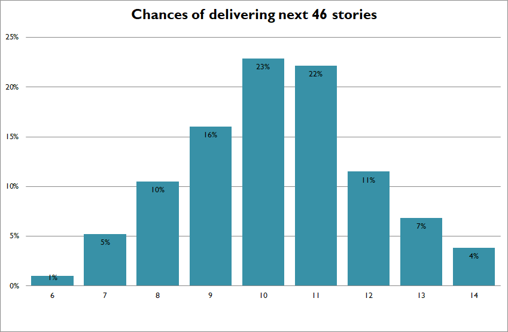
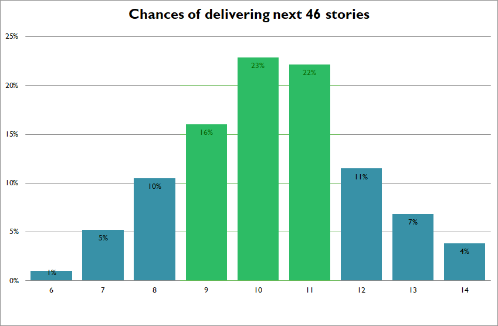
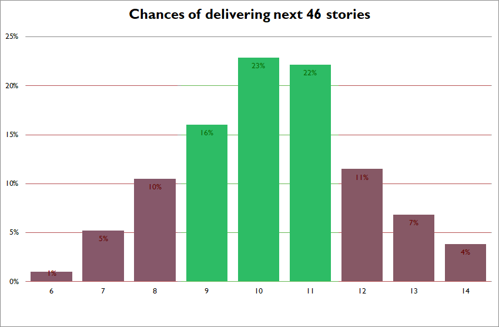
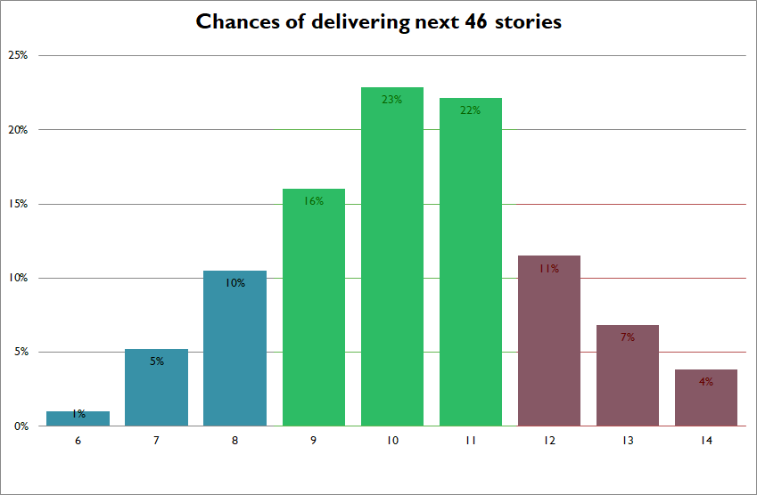
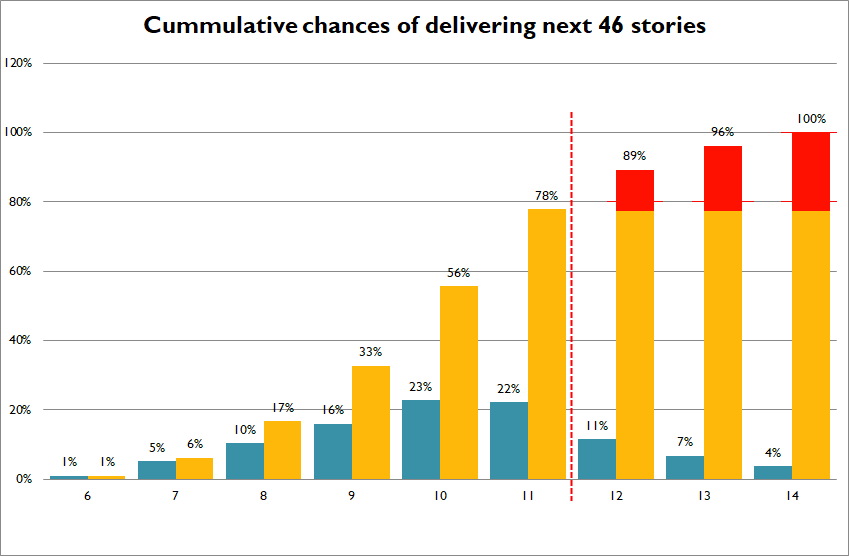
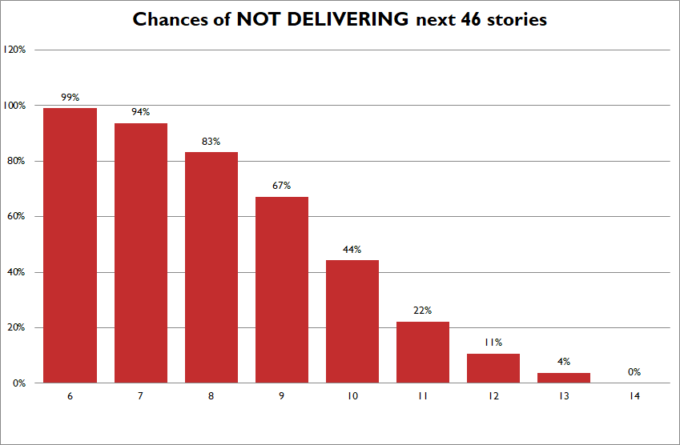
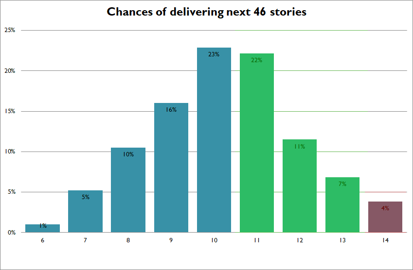

# We need more accurate estimates

## Why this range is so wide?

I guess that's something that most of us heard at least one time. We looked at a pile of work with no point of reference and were asked about how long it's going to take. There is an answer which is always wrong and doesn't help anyone: **I don't know**

But sometimes even if we have a clue or apply some estimation technique the results might not be very compelling to your team or stakeholders when the estimate range comes wider than expected (sic!). Some people will come with a witty advice to look at the work complexity - but complexity is only one factor that drives time and budget estimates. There are far more variables and finding them and approximating can be done only by doing the work.

I'm a big fan of Monte Carlo simulations when it comes to estimation. Regardless if you apply Monte Carlo method or use other statistical method to provide a range of time that, in most cases, become a budget of a project or initiative, the range might come quite wide.

Recently I was in the situation when the most accurate estimate I was able to offer was between 7 and 14 sprints. Correct, I could be off twice. That's asking customer: _"I'll need between N and 2*N dollars to get the backlog finished"_. Also, it's a fixed scope job that adds its own twist to the whole story.

Probably, something like _"hold on, that's if you assume there are no changes to backlog"_ might cross your mind. Yeah, fixed scope jobs can bite both ways.

## _"A more accurate estimate"_

### Computer said - _"7 to 14 sprints"_

Let's walk through a sample scenario of estimating a delivery time of 46 user stories. We go through the backlog, do the relative sizing, run simulated sprint planning to get velocity distribution and plugging data into a simulation deck. We look with the hope on the screen and computer says - 7 to 14 sprints.

What? 7 to 14 sprints? that's a wide range... and it will take a lot of explanation... Let's check the numbers, fix few manually to look better. No changes. Probabilities change slightly but the verdict remains - 7 to 14 sprints. We bring the result with the full story about estimation method to client and:

_-"That's nice... but... can you give us a more accurate estimate?"_

_-"Sure, we can do everything on the paper. The question is what do we want to achieve. Do you want me to tell you something that sounds nice so we can have few nights of sleep before the death march or sould we talk about potential risks while we have time to react?"_

_-"But what if project sponsors don't agree?"_

_-"How about - what if project sponsors agrees and we miss the target?"_

### Beware of average

My stats teacher use to say - people get drowned in an average of 1m depth lakes.

The big temptation in our situation is to ask a question about the level of acceptable contingency and narrow the range using all the available power of a wishful productive group thinking. It could look something like that if we tried really hard, right?

_-"Ah... 3 sprints range... now we're talking. Great job!"_

Hold on! What about the nasty tails of the estimate? Let's take a step back - when I told you that I'm goping to deliver the scope between 7 and 14 sprints what I was really saying was:

_-"I'm 99.999% confident the work will be done between 7 and 14 sprints"-_

when I narrowed the range I'm saying:

_-"I'm 61% confident the work will be done between 9 and 11 sprints"-_

_-"61%?! But that's not what we discussed!"_

_-"You wanted a narrow estimate - there you go..."_

### What about the risk?

See the tails outside of the nice and narrow estimate - that's where remaining 39% sits, and guess what that's a risk.

_-"What about the left side? You can finish earlier right?"_

You're right, there is a 16% chance that it's going to happen, but fair enough, let's just talk about the right side only - when I give you 3 sprints wide estimate around the average, we started to bet on a game where you can win in 4 out of 5 times. How much money could you put on that given you have only one chance? Let me demonstrate it differently.

If we missed the top bar of estimated time or budget, which can happen in 22% of times after sprint 11, there would be work not delivered. There are many ways of dealing with this situation, we could actually remove something from the scope, but for the sake of the argument, let's pretend the backlog consist only from must-have-compliance-or-we-get-sued items. Has to be delivered.

In a scenario like this I would look at the model differently. Instead of looking at chances or cumulative chances of delivering the scope, let's look at the risk of not delivering scope by sprint:

Does it help with estimating chances? Even though average says we should deliver it in around 9 sprints - it's close to 50/50. How much money would you put on a flip-coin bet?

### Better narrow range?

One approach would be to move the nice narrow range to the right side (because we need to give ranges, right) and present an estimate 11 to 13 sprints with 4% of risk. Theoretically it's a nicer approach but in practice we're bloating the estimate in the old waterfall style: team says $X. Project manager (with experience) knows it will be closer to $2\*X and while project sponsor reaches for 4\*$X to the pocket because it's not the first time when the team and project manager got it wrong.

### What to do?

Yes, we have an ugly, wide estimate. It doesn't make anyone happy - trust me. But we can deal with it. First of all - explain the estimation approach, complexity, known factors and potential sources of risks. Secondly - yes, today the estimate is ugly, but guess what, more we learn about the project, we can update it with actual values and it will become more narrow. It's might change it's parameters and move to the left or the right but with cycles short enough we will have enough time to react on these changes. Good news, it doesn't look like it's going to be longer than 14 sprints... There's only 0.0001% chance.